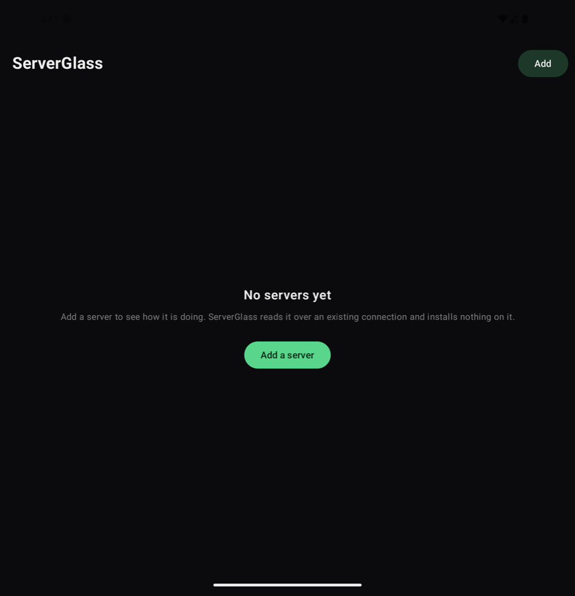
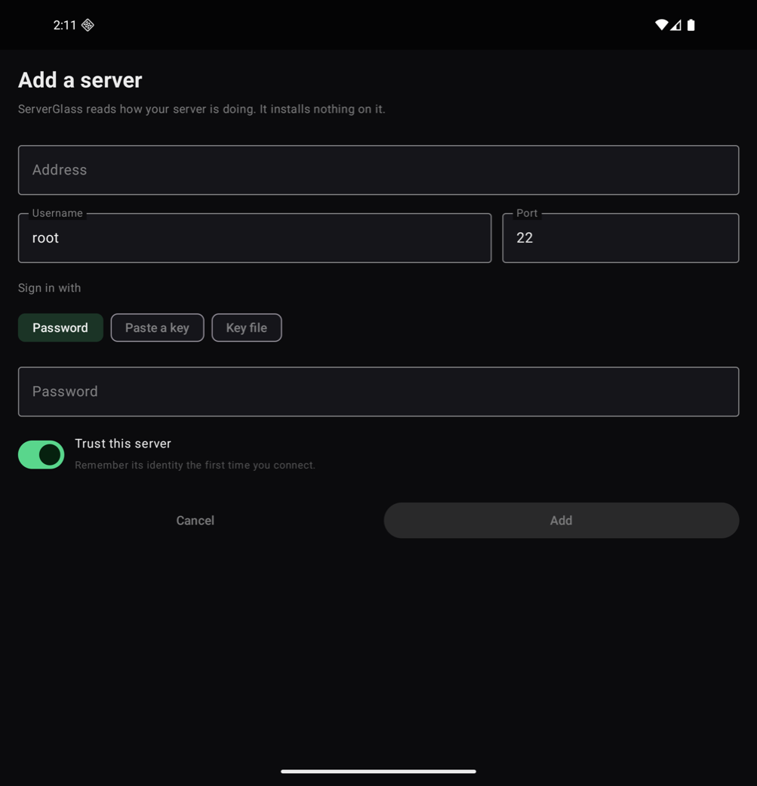
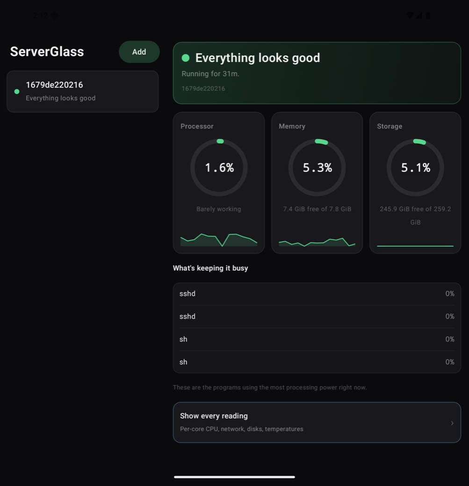
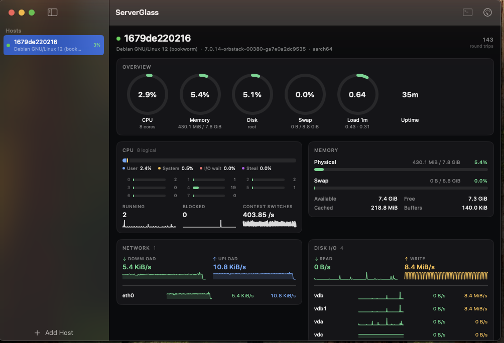
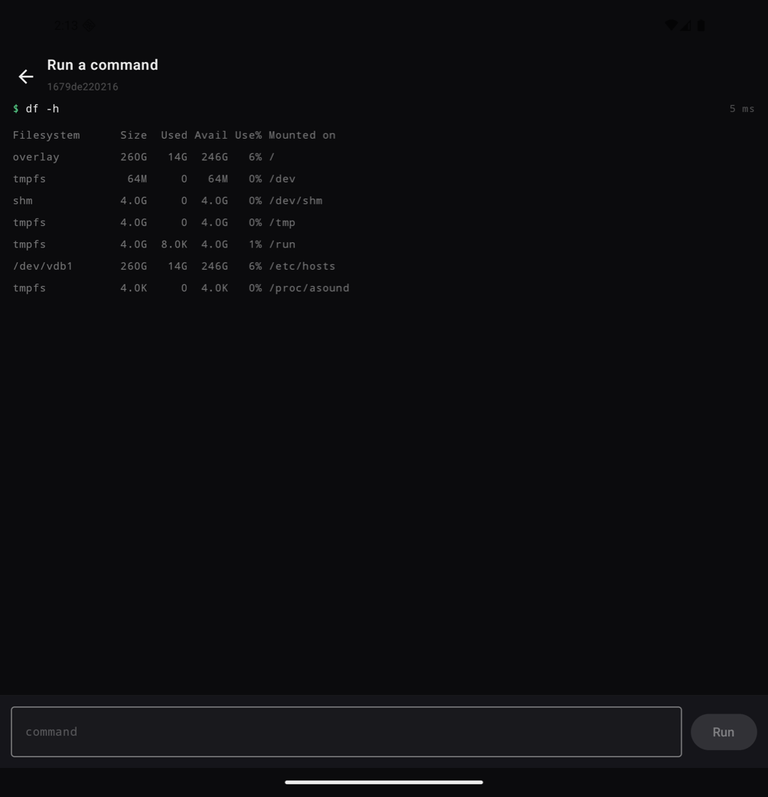

# Using ServerGlass

Every flow, in order, with what you should see at each step.

ServerGlass reads a server over SSH and installs nothing on it. If you can `ssh` to a machine, you
can watch it here — there is no agent to deploy, no port to open, and nothing to undo later.

- [Adding your first server](#adding-your-first-server)
- [Reading the summary](#reading-the-summary)
- [Every reading](#every-reading)
- [Running a command](#running-a-command)
- [Editing or removing a server](#editing-or-removing-a-server)
- [Signing in without a password](#signing-in-without-a-password)
- [On a foldable, a tablet, or a Mac](#on-a-foldable-a-tablet-or-a-mac)
- [If something goes wrong](#if-something-goes-wrong)

---

## Adding your first server

A new install has nothing in it and says so.

| Android | iPhone |
|---|---|
|  |  |

Tap **Add a server** (**Add Host** on Apple). You need four things:

1. **Address** — the hostname or IP you would `ssh` to.
2. **Username** — the account to sign in as.
3. **Port** — 22 unless you changed it.
4. **How to sign in** — a password, a pasted key, or a key file.

**Trust this server** decides what happens the first time this machine's identity is seen. Leave it
on for a server you know; ServerGlass records that identity and will refuse to connect later if it
changes, which is what protects you from something impersonating your server. Turn it off and the
first connection is refused until you have verified the fingerprint yourself.

Tap **Add**. The server appears in the list and starts reading within a second or two.

> Your password or key is stored in the platform's own vault — the Keychain on Apple, the Android
> Keystore on Android — and never in the file that holds the rest of the server's settings. If a
> device's secure storage is unavailable, the add screen tells you so rather than pretending.

---

## Reading the summary

The default screen answers one question: **is my server OK?**

- The **verdict** at the top is a sentence, not a number — "Everything looks good", "Storage is
  almost full", "Running very hot" — and it always includes the size of the problem.
- **Processor, Memory, Storage** are the three readings that mean something without training. Each
  shows its recent trend beneath it.
- **What's keeping it busy** is the programs using the most processor time right now.

Nothing here needs interpreting. If it says everything looks good, everything looks good.

---

## Every reading

Tap **Show every reading** at the bottom of the summary. On a Mac use the toolbar button.

Same panels in the same order on every platform:

| Panel | What it answers |
|---|---|
| **Overview** | Processor, memory, disk, swap, temperature, load, uptime at a glance |
| **CPU** | How the time splits — user, system, I/O wait, steal — and every core individually |
| **Memory** | Physical and swap as capacities, then the breakdown that does not always add up (ZFS) |
| **Network** | Total throughput, then each interface that is actually carrying traffic |
| **Disk I/O** | Read and write rates, then each real device — not the LVM and dm layers on top of it |
| **Processes** | The busiest, with each one's share **of the whole machine** rather than of one core |
| **Filesystems** | Every mount, how full |
| **Temperature & power** | Every sensor the machine exposes, hottest first |
| **Sockets & TCP** | Connection counts and retransmits |

A ring is only ever drawn for something with a real maximum. Rates get a number and a trend line,
because there is no such thing as 100% of a download speed.

Temperatures are judged against each chip's own critical point where it publishes one — an NVMe
drive specified to 70°C and a processor specified to 100°C are not the same 68°C.

---

## Running a command

Open the terminal icon in the header of the readings screen.

Type a command, press **Run**. It executes on the connection ServerGlass already has open, so
there is no second sign-in and the server logs one session rather than two. The exit code and how
long it took are shown beside each command; a failure shows its error message, because that is the
answer you wanted.

**This is not a terminal.** No pseudo-terminal is allocated, so anything interactive — `top`,
`vim`, `sudo` asking for a password — will hang until it times out rather than working. It is for
the things people actually reach for from a phone: `systemctl restart nginx`, `df -h`, `docker ps`,
`tail -n 50 /var/log/syslog`.

Commands are refused while a server is unreachable rather than queued, so nothing you typed and
gave up on fires by surprise five minutes later.

---

## Editing or removing a server

- **Android** — long-press the server in the list, then **Edit…** or **Remove**.
- **iPhone and iPad** — long-press the row for the same menu, or swipe.
- **Mac** — right-click the sidebar row.

The edit form is the add form with the values filled in. One thing behaves differently: a blank
password or key box means *leave what is stored alone*, not *erase it*. The form cannot show you an
existing credential — it lives in the Keychain and is fetched only when connecting — so treating a
blank box as a deliberate erasure would quietly discard the credential of anyone who came in to
change a port number.

Removing a server erases its stored password too. It does not touch the server.

---

## Signing in without a password

A phone has no `ssh-agent` and no folder to browse for a key, which is why **Paste a key** exists.

1. Copy your private key — the whole thing, including the `-----BEGIN` and `-----END` lines.
2. Choose **Paste a key**, then tap **Paste**.
3. Add the passphrase below it if the key has one.

The box is deliberately several lines tall and monospaced so you can see both ends of the key and
tell a complete paste from a truncated one. If a key does not decode, ServerGlass says the key
could not be read and what to check — not `Base64 decoding error: invalid length at 272`.

The key is stored in the Keychain or Keystore and sent to nothing but the server you are
connecting to.

On a Mac, **SSH agent** is the better option and the default: ServerGlass never sees the key at all.

---

## On a foldable, a tablet, or a Mac

The layout is driven by the width available, measured continuously rather than decided at launch:

- **Narrow** — one screen at a time, list then detail.
- **Wide** — list and detail side by side, and the panels pair up two across.
- **Unfolding** — the layout reflows as the hinge opens. The connection is not dropped and the
  charts do not restart.
- **A vertical hinge** — the two panes split *at* the hinge and the seam is left empty, so nothing
  you are reading sits under the fold.

---

## If something goes wrong

| What you see | What it means |
|---|---|
| **Can't reach this server** | Nothing answered. Check the machine is on and you are on the same network or VPN. |
| **The username or key was not accepted** | The credentials are not the ones this server expects. |
| **This server's identity is different from last time** | The host key changed. That can mean the server was rebuilt — or that something is impersonating it. Do not reconnect until you know which. |
| **Collector(s) reported a problem** | Some readings are unavailable on this host; the rest still work. |
| **Running very hot** | The processor is at or near the temperature where it throttles itself. Usually dust or a blocked intake. |

A server that stops answering is retried automatically, with a gap that grows from one second up to
thirty, so a machine that is switched off is not hammered.

---

## What ServerGlass will not do

- It installs nothing, writes nothing, and changes nothing on a monitored server. The only
  exception is a command you type yourself in the command runner.
- It writes no measurement to disk. Readings live in memory for about five minutes so the charts
  can be drawn, and are then dropped. History and alerting belong to whatever you export to.
